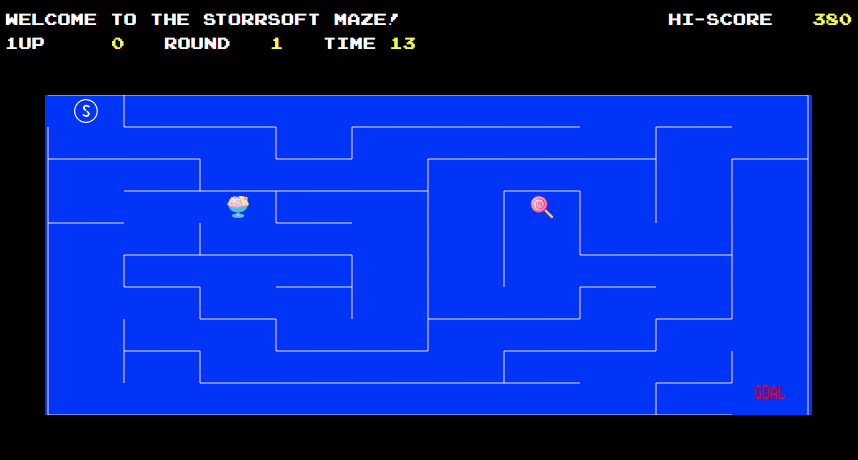

<!-- PROJECT LOGO -->
<br />
<p align="center">
    <a href="https://github.com/roee030/Maze-Game-React/">	
     
  </a>
  


  <h3 align="center">Maze App</h3>

1.	To install run: ```npm install``` and to start the project run: ```npm start```.
2.  You need to solve the maze and get as many points as you can!
3.  Your clock is ticking, so hurry up before the time goes to 0.
4.  There are 2 prizes that help you get more points and time:
  4.1.  Lollipop: 5000 pts, 15 seconds.
  4.2.  Ice cream: 10000 pts, 30 seconds.
5. If you will solve maze with more 60 sec you will continue to the next stage with the same amount of time.
6. All is left is to enjoy!
7. demo: https://serene-beaver-717000.netlify.app/
</p>
